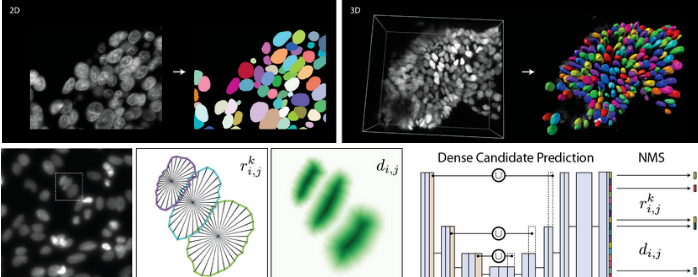

```{r setup, include=FALSE}
options(htmltools.dir.version = FALSE)
knitr::opts_chunk$set(
  fig.width=9, fig.height=3.5, fig.retina=3,
  out.width = "100%",
  cache = FALSE,
  echo = TRUE,
  message = FALSE, 
  warning = FALSE,
  hiline = TRUE
)
```

```{r xaringan-themer, include=FALSE, warning=FALSE}
library(xaringanExtra)
library(xaringanthemer)
style_duo_accent(
  primary_color = "#035AA6",
  secondary_color = "#03A696")
```

```{r xaringanExtra, echo = FALSE}
xaringanExtra::use_progress_bar(color = "#0051BA", location = "top", height = "10px")
```


## Nuclei Segmentation with StarDist

.pull-left[

**By:** Uwe Schmidt, Martin Weigert

- Open source

- Fiji Plugin

- Out-of-the-box models for 2D Fluorescent and H&E images

- Training Notebooks available via StarDist and ZeroCostDL4Mic

- QuPath implementation: Extension, Running through script, Cell Expansion


[Cell Detection with Star-convex Polygons. MICCAI, 2018](https://arxiv.org/abs/1806.03535)
]

.pull-right[

```{r, echo=FALSE, warning=FALSE, message=FALSE, dev='svg'}

```


[StarDist](https://github.com/stardist/)
]

