```{r setup, include=FALSE}
options(htmltools.dir.version = FALSE)
knitr::opts_chunk$set(
  fig.width=9, fig.height=3.5, fig.retina=3,
  out.width = "100%",
  cache = FALSE,
  echo = TRUE,
  message = FALSE, 
  warning = FALSE,
  hiline = TRUE
)
```

```{r xaringan-themer, include=FALSE, warning=FALSE}
library(xaringanExtra)
library(xaringanthemer)
style_duo_accent(
  primary_color = "#035AA6",
  secondary_color = "#03A696")
```

```{r xaringanExtra, echo = FALSE}
xaringanExtra::use_progress_bar(color = "#0051BA", location = "top", height = "10px")
```

## Outlines

- Introduction to Machine Learning
  - Definitions and Key Concepts
  
  - Types of Machine Learning

- Approaches and Applications
  - Data-Driven Approach
  
  - Image Classification
  
  - Classification Models and Algorithms
  

- Software Overview
  - CellProfiler & CellProfiler Analyst
  
  - QuPath
  
---

## Machine Learning - Definitions

- **Machine Learning** is concerned with the technology that enables computer 
programs to improve their performance at a certain task by experience.

--

- In Machine Learning we want to infer (learn) some function `f` from data, 
capable of predicting the output `y` from an input (measurement) x:

$$y = f(x)$$

--

- The data is used to learn `f` is called **training set**.

--

- In this general formulation, there is no particular limitation as to the 
mathematical nature of `x` and `y` . In many cases `x` is a P-dimensional vector
and `y` a categorical or continuous output variable, but there are 
other settings, where `x` and / or `y` are more complicated objects, 
such as images or graphs.

---

## Types of Machine Learning

.pull-left[
```{r, echo=FALSE, warning=FALSE, message=FALSE, out.width = "120%"}
library(DiagrammeR)
#library(webshot)

#webshot::install_phantomjs()
DiagrammeR::mermaid("
  graph TD
  A{<b>Machine Learning</b>} --> B{<b>Supervised Learning</b>}
  A --> C(<b>Unsupervised Learning</b>)
  A --> D(<b>Reinforcement Learning</b>)
  B --> E[<b>Classification</b>]
  B --> F[<b>Regression</b>]
  style A fill:#E5E25F
  style B fill:#E5E25F
  style C fill:#87AB51
  style D fill:#87AB51
  style E fill:#B6E6E6
  style F fill:#B6E6E6
")
```
]

.pull-right[
- In **supervised learning**, the training data contains both measurements $x_i$
and the corresponding output variables $y_i$.   
Together, they build the training set `T`:
$$T = {(x_i, y_i)}i = 1,...,N$$
- In **unsupervised learning**, there are no annotations $y_i$. We aim at inferring
**patterns** from the data.
]

---

## Classification vs Clustering

```{r, echo=FALSE, warning=FALSE, message=FALSE, out.width='60%', dev='svg'}
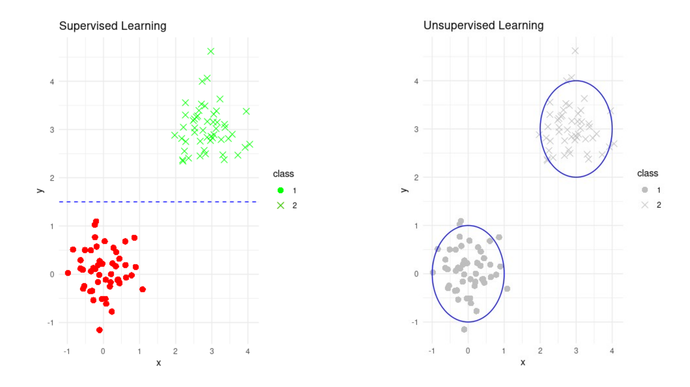
```
- In **supervised learning**, we start from annotated data (here
annotation is illustrated by the color), and we wish to learn a
decision boundary that allows us to tell these classes apart.

- In **unsupervised learning**, we start with a point clouds and
we wish to identify classes directly from their distribution.

---

## Machine Learning: Data Driven Approach

```{r, echo=FALSE, warning=FALSE, message=FALSE, out.width='62%', dev='svg'}
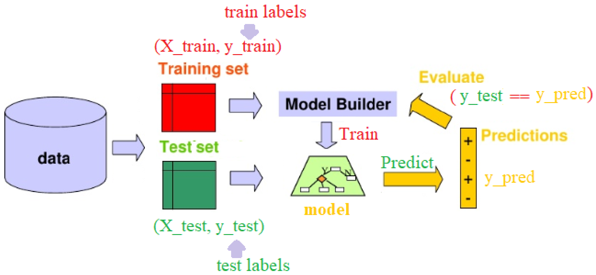
```

1. Collect a dataset of images and labels.
2. The dataset will be splitted into **Training set** and **Test set**.
3. Use Machine Learning algorithm to train a **classifier** using the training dataset.
4. The classifier will be used to **predict** the labels of the images from the test dataset.
5. The predicted labels will be subsequently compared with the **ground-truth** labels to evaluate the performance of the classifiers.
6. Evaluate the classifier on **new images**.

---

## Image classification

We are going to use a classic dataset in machine learning, https://archive.ics.uci.edu/ml/datasets/Optical+Recognition+of+Handwritten+Digits, consisting of 8x8 grayscale images of handwritten digits.


### Loading the MNIST (handwritten digits) dataset

```{r, echo=FALSE, message=FALSE, warning=FALSE, comment=""}
library(reticulate)
#py_config()
#virtualenv_create("BC-2023")
use_virtualenv('BC-2023', required = TRUE)

#py_install("matplotlib")
#py_install("scipy")
#py_install("scikit-learn")
#py_install("pandas")
#py_install("seaborn")
```
```{python, echo =TRUE}
# Import the digits dataset
from sklearn import datasets

# Load the digits dataset
digits = datasets.load_digits()
```

---

### Visualizing the dataset

.pull-left[
```{python, echo = TRUE, eval = FALSE}
import numpy as np
import matplotlib.pyplot as plt

# Set the figure size
plt.figure(figsize=(5, 5))

# Display the first 16 images
for index, (image, label) in enumerate(zip(digits.data[:16], digits.target[:16])):
    plt.subplot(4, 4, index + 1)
    plt.imshow(np.reshape(image, (8, 8)), cmap=plt.cm.gray)
    plt.title('%i' % label, fontsize=10)
    plt.axis('off')

plt.tight_layout()
plt.show()
```
]
.pull-right[
```{python, echo = FALSE, results = "hide"}
import numpy as np
import matplotlib.pyplot as plt

# Set the figure size
plt.figure(figsize=(5, 5))

# Display the first 16 images
for index, (image, label) in enumerate(zip(digits.data[:16], digits.target[:16])):
    plt.subplot(4, 4, index + 1)
    plt.imshow(np.reshape(image, (8, 8)), cmap=plt.cm.gray)
    plt.title('%i' % label, fontsize=10)
    plt.axis('off')

plt.tight_layout()
plt.show()


```
]

---

### Splitting the dataset 

```{python, echo = TRUE}
from sklearn.model_selection import train_test_split

# Split the data into training and test sets
X_train, X_test, y_train, y_test = train_test_split(digits.data, 
digits.target, test_size=0.2, random_state=42)

# Display a summary of the data sets
print(f"Size of training data: {X_train.shape[0]}")
print(f"Size of test data: {X_test.shape[0]}")
```

---

### SVM classifier

Support Vector Machine is a supervised learning algorithm which <u> aims to separate the classes through a straight line</u>, by maximizing the margins between the classes.

#### Hard Margin

.pull-left[
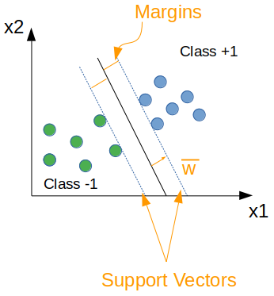
]

.pull-right[
At inference time, what lies on the right side of the margin will be classified as "class 1" and vice versa.   
   
**Constraints..**
$$
\begin{aligned}
y_i &= +1 \mapsto \vec{w}\vec{x_i}+b \ge 1 \\
y_i &= -1 \mapsto \vec{w}\vec{x_i}+b \le -1
\end{aligned}
$$

]

---

### SVM classifier

#### Soft Margin

.pull-left[
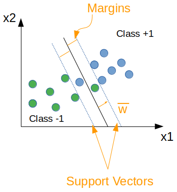
]

.pull-right[

$$
\begin{aligned}
C\underset{i}\sum{\varepsilon_i}\;s.t.\;y_i(\vec{w}\vec{x_i}+b) \ge 1 - \varepsilon_i\\ 
\forall i=1,...,n  
\end{aligned}
$$
- if C is small, the margin is big
- If C $\mapsto \infty$, hard svm 
- If $0 < \epsilon \le 1$ (correct)
- If $\epsilon > 1$ (wrong)
]

---

### SVM classifier

#### Kernel trick

.pull-left[
```{r, echo=FALSE, warning=FALSE, message=FALSE, dev='svg'}
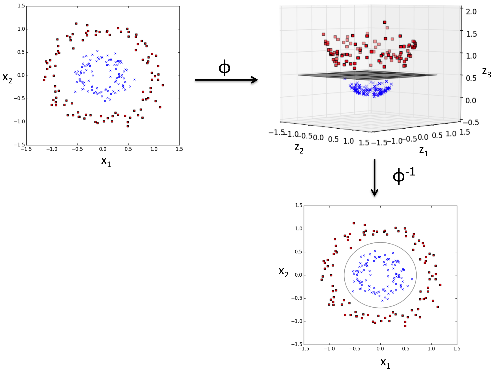
```
]

.pull-right[
**Common Kernels**

- Sigmoid kernel: $K(x_i,x_j) = tanh(\alpha x_i^Tx_j+c)$

- Polynomial kernel: $K(x_i, x_j) = (x_i.x_j+1)^p$

- Radial Basis Function: $K(x_i, x_j) = exp(-\gamma(x_i - x_j)^2)$

]

---

### Train, predict the SVM classifier using the MNIST dataset

```{python, echo = TRUE}
from sklearn.svm import SVC

# Create an SVM classifier
svm = SVC(kernel='linear')

# Train the classifier
svm.fit(X_train, y_train);

# Predict using the classifier
y_pred = svm.predict(X_test)
```
```{python, echo = FALSE}

# Find the indices of correct and incorrect predictions
correct_indices = np.where(y_pred == y_test)[0]
incorrect_indices = np.where(y_pred != y_test)[0]

# Randomly select an index from the correct and incorrect predictions
good_pred_index = np.random.choice(correct_indices)
bad_pred_index = np.random.choice(incorrect_indices)

# Display the images
plt.figure(figsize=(12, 3))

# Image with correct prediction
plt.subplot(1, 2, 1)
plt.imshow(X_test[good_pred_index].reshape(8, 8), cmap='gray')
plt.title(f"True: {y_test[good_pred_index]}, Predicted: {y_pred[good_pred_index]}")

# Image with incorrect prediction
plt.subplot(1, 2, 2)
plt.imshow(X_test[bad_pred_index].reshape(8, 8), cmap='gray')
plt.title(f"True: {y_test[bad_pred_index]}, Predicted: {y_pred[bad_pred_index]}")

plt.tight_layout()
plt.show()
```
---

### Evaluate the SVM classifier

#### Confusion Matrix

| |Predicted "non-spam"| Predicted "spam"|
--|--------------------|-----------------|
|Actual "non-spam"| 50 | 10|
|Actual "spam"| 5 | 35 |

- **True Positives (TP)**: Emails that are actually spam and the algorithm correctly classified as such. In our example, there are 35 TPs.

- **True Negatives (TN)**: Emails that aren't spam and the algorithm correctly classified as non-spam. In our example, there are 50 TNs.

- **False Positives (FP)**: Emails that aren't spam but the algorithm incorrectly classified as spam. In our example, there are 10 FPs.

- **False Negatives (FN)**: Emails that are actually spam but the algorithm incorrectly classified as non-spam. In our example, there are 5 FNs.

<u>Confusion matrix</u> is useful to calculate precision, recall, and accuracy!!

---

### Evaluate the SVM classifier (continued)

#### Precision


$$Precision = \frac{TP}{TP + FP}$$
Out of all items predicted as positive by the model, how many were actually positive?

#### Recall

$$Recall = \frac{TP}{TP + FN}$$
Out of all items that are actually positive, how many did the model correctly predict as positive?

---

### Evaluate the SVM classifier (continued)

#### F1-Score

It's defined as the harmonic mean of precision and recall:

$$F1 = 2 \times \frac{Precision \times Recall}{Precision + Recall}$$

#### Accuracy

$$ Accuracy = \frac{TP + TN}{TP + TN + FP + FN}$$
Out of all predictions made by the model, how many were correct?

---

### Evaluate the SVM classifier using the MNIST dataset

```{python, echo = TRUE, out.width="45%"}
from sklearn import metrics
import pandas as pd
import seaborn as sn

# Confusion matrix
cm = metrics.confusion_matrix(y_test, y_pred)
df_cm = pd.DataFrame(cm, range(10), range(10))
sn.set(font_scale=1.2)
plt.figure(figsize=(14, 7))
sn.heatmap(df_cm, annot=True, annot_kws={"size":16}, fmt="g")
plt.show()
```

---

### Evaluate the SVM classifier using the MNIST dataset (continued)

```{python, out.width="30%"}

# Print the classification report
print(
    f"Classification report for classifier {svm}:\n"
    f"{metrics.classification_report(y_test, y_pred)}\n"
)

```

---

### Tuning the hyper-parameters of an classifier

#### GridSearchCV

- It helps to loop through predefined <u>hyperparameters</u> and fit your estimator (model) on your training set.

- You can select the best parameters from the listed hyperparameters.

---

### Tuning the hyper-parameters of the SVM classifier using the MNIST dataset

```{python, echo=TRUE}
from sklearn.model_selection import GridSearchCV

# Defining the hyperparameter grid
param_grid = {
    'C': [0.1, 1, 10, 100],
    'gamma': [0.0001, 0.001, 0.1, 1],
    'kernel': ['linear', 'rbf', 'poly']
}

# Initializing the SVM classifier
svc = SVC()

# Setting up GridSearchCV
model = GridSearchCV(svc, param_grid, n_jobs=10)

# Fitting the model with the training data
model.fit(X_train, y_train);

# After the grid search, you can get the best parameters like this:
print("Best parameters found:", model.best_params_)

```

---

### Predict and Evaluate the "Best Model"

```{python, echo = TRUE, out.width="40%"}
# Predict using the best model
y_pred = model.best_estimator_.predict(X_test)

# Compute the confusion matrix
cm = metrics.confusion_matrix(y_test, y_pred)

# Visualize the confusion matrix using seaborn
df_cm = pd.DataFrame(cm, range(10), range(10))
sn.set(font_scale=1.2)
plt.figure(figsize=(14, 7))
sn.heatmap(df_cm, annot=True, annot_kws={"size":16}, fmt="g")
plt.show()
```

---
### Evaluate the best classifier

```{python, out.width="30%"}

# Print the classification report
print(
    f"Classification report for classifier {model.best_estimator_}:\n"
    f"{metrics.classification_report(y_test, y_pred)}\n"
)

```

---

### From SVM to Random Forest: Addressing Weaknesses

#### Weaknesses of SVM

- **Sensitivity to High Dimensionality**: SVMs can become less effective as the dimensionality and size of the dataset increase.
- **Kernel Selection and Tuning**: Choosing and tuning the appropriate kernel can be complex and non-intuitive.
- **Less Efficient on Large Data**: SVMs require longer computation time for large datasets.
- **Difficulty in Interpretation**: The decision boundaries in SVMs, especially with non-linear kernels, are often hard to interpret.

--

#### Advantages of Random Forest

- **Effective Handling of High Dimensionality**: Performs well even with a large number of features and data.
- **Robustness to Noisy Data**: Tolerates noise and outliers well.
- **Interpretability**: Provides more intuitive understanding through the aggregation of individual tree decisions.
- **Flexibility and Versatility**: Effective for a wide range of classification and regression tasks, with less risk of overfitting.

---

### Decision tree - Algorithm

.pull-left[
```{r, echo=FALSE, warning=FALSE, message=FALSE, dev='svg'}
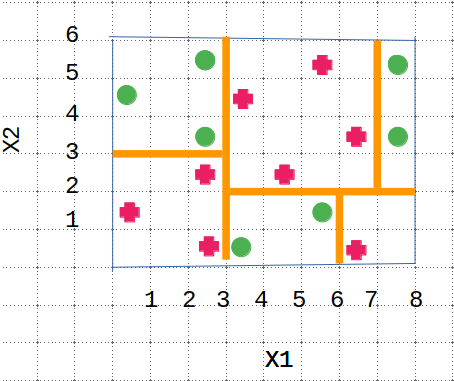
```
]

.pull-right[
##### The (binary) decision tree
```{r, echo=FALSE, warning=FALSE, out.width="90%", message=FALSE, dev='svg'}
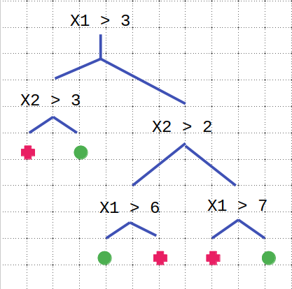
```
]

---

### Decision tree - Node splitting

- **Gini impurity**: Select the one having lowest Gini Impurity   
$$
\begin{aligned}
GiniImpurity &= 1 - Gini \\
Gini &= \sum_i(p_i^2)
\end{aligned}
$$
- **Information Gain**: Select the one having highest IG or lowest Entropy   
$$
\begin{aligned}
IG &= 1 - Entropy \\
Entropy &= -\sum_i(p_ilog_2p_i)
\end{aligned}
$$
---
#### Example

```{r, echo=FALSE, warning=FALSE, message=FALSE, dev='svg', out.width='40%'}
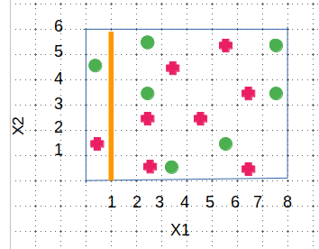
```

```{r, echo=FALSE, warning=FALSE, message=FALSE, dev='svg', out.width='50%'}
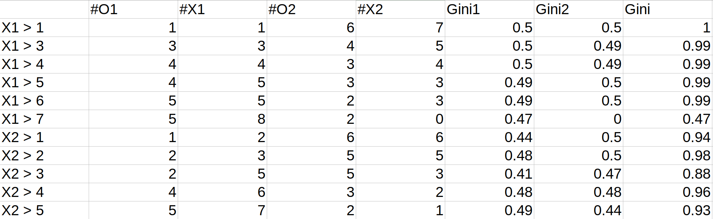
```


---
#### Pros and cons of decision trees 

- Advantages

  - Simple to interpret.
  - Can handle numerical and categorical data.
  - Little data preparation.
  - Fast.
  
- Disadvanages

  - Susceptible to noise.
  - Greedy algorithm is locally optimal.
  - Chance of overfitting.

---

### Random Forest

- Random forest is a **collection of decision trees**.

- Each tree is trained on a **bootstrap sample** of the training data (random sampling with replacement)

- Each node considers a **random subset** of dimensions.

- As a consequence, each DT is different.

- At runtine:

  - The new observation is **classified by all N trees**.
  
  - **Majority vote**.
  
  - Additionally provides **uncertainty** information.

---

#### Classification using random forest

```{r, echo=FALSE, warning=FALSE, out.width="75%", message=FALSE, dev='svg'}
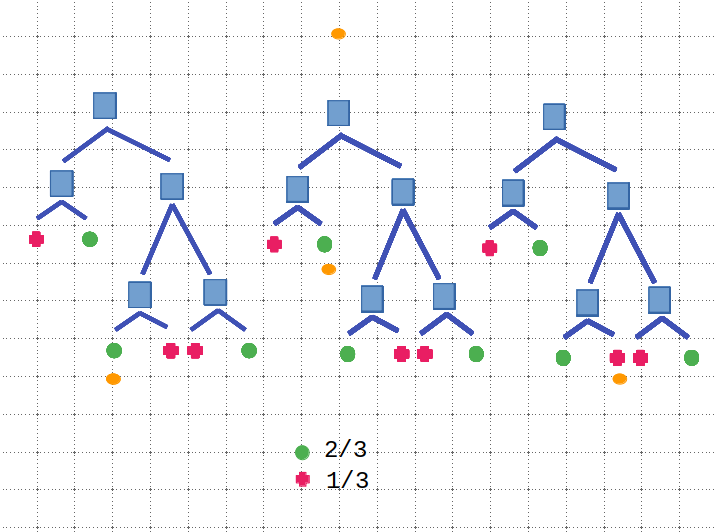
```

---

#### Apply the Random Forest classifier on MNIST dataset


```{python, echo=TRUE}
from sklearn.ensemble import RandomForestClassifier
from sklearn.metrics import accuracy_score

# Load MNIST dataset
digits = datasets.load_digits()

# Split the data into a training set and a test set
X_train, X_test, y_train, y_test = train_test_split(digits.data, digits.target, test_size=0.5, random_state=42)

# Initialize the classifier
clf = RandomForestClassifier(n_estimators=100)

# Train the classifier
clf.fit(X_train, y_train);

# Make predictions on the test data
y_pred = clf.predict(X_test)

# Calculate and print the accuracy
accuracy = accuracy_score(y_test, y_pred)
print(f"Accuracy of Random Forest Classifier: {accuracy:.4f}")
```

---

## Introduction to CellProfiler 

### Open-source software for image analysis

.pull-left[

```{r echo=FALSE, message=FALSE, warning=FALSE, dev='svg', out.width='15%'}

```

- Free and open-source; Windows, Mac, Linux.

- Image analysis & **quantification**.

- Cited in **1000+** papers per year.

]

.pull-right[
```{r, echo=FALSE, warning=FALSE, out.width="80%", message=FALSE, dev='svg'}
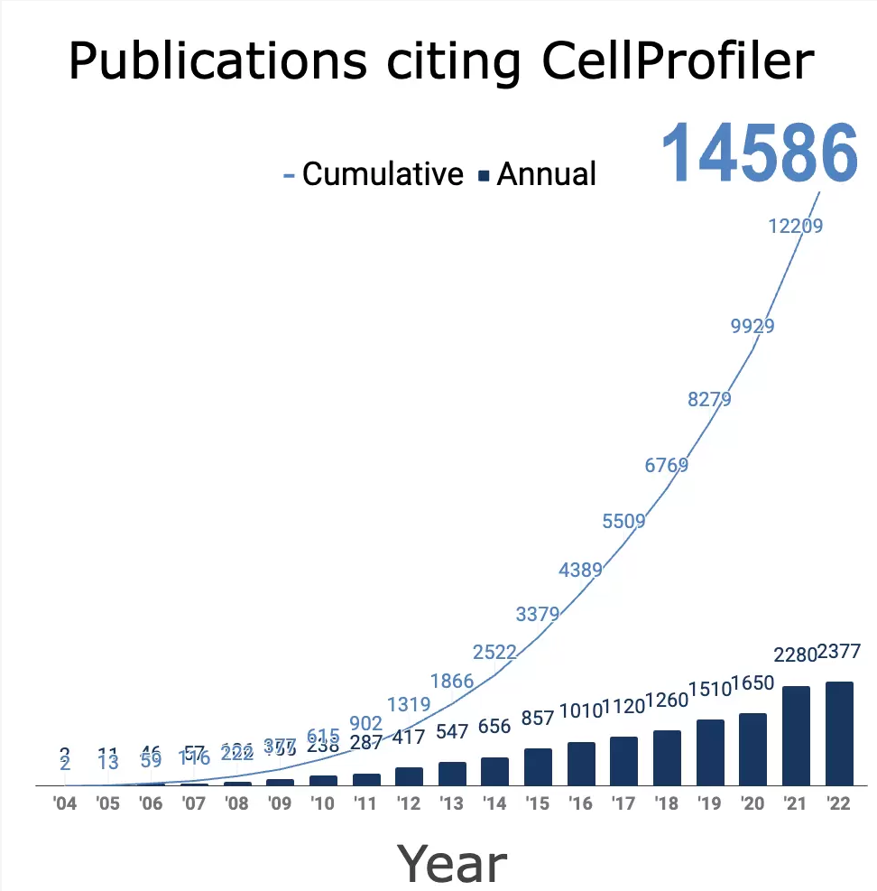
```
]

---

### Main CellProfiler window

```{r, echo=FALSE, warning=FALSE, out.width="80%", message=FALSE, dev='svg'}
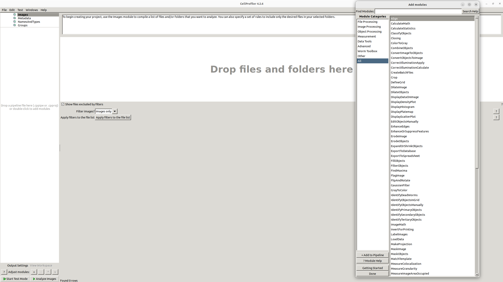
```

---

## Introduction to CellProfiler Analyst

### Open-source software for data exploration

```{r, echo=FALSE, warning=FALSE, message=FALSE, dev='svg', out.width='8%'}

```

- Free and open-source; Windows, Mac, Linux.

- Image-centric data analysis & machine learning.

--

### Main CellProfiler Analyst window

```{r, echo=FALSE, warning=FALSE, out.width="80%", message=FALSE, dev='svg'}
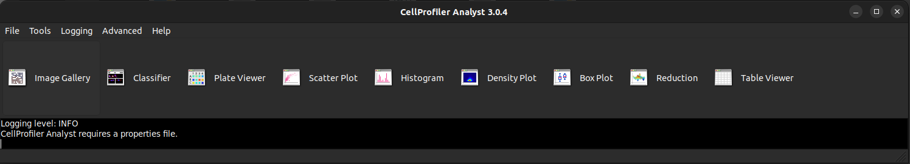
```

---

## CellProfiler & CellProfiler Analyst

### Demo: Using machine learning to perform translocation assay

Hypothesis: treatment causes GFP translocation from cytoplasm to nucleus.

```{r, echo=FALSE, warning=FALSE, out.width="80%", message=FALSE, dev='svg'}
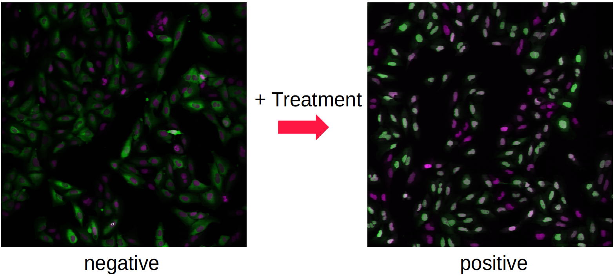
```
---

## CellProfiler & CellProfiler Analyst

### Exercise: Using machine learning to perform cell painting assay

```{r, echo=FALSE, warning=FALSE, out.width="80%", message=FALSE, dev='svg'}
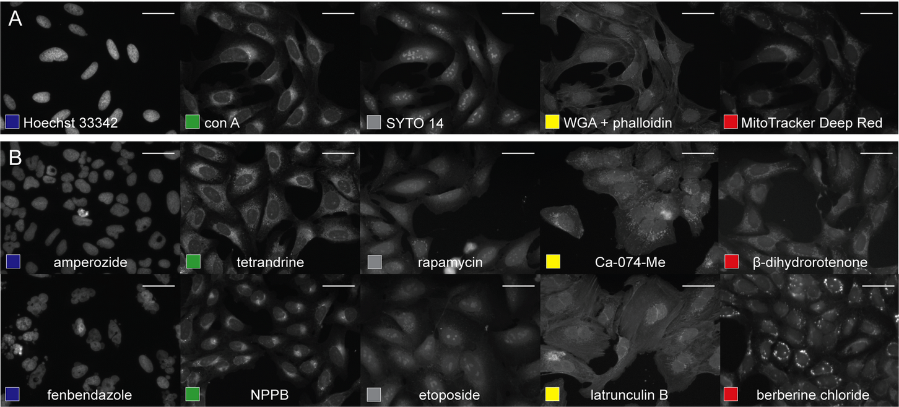
```

---

## Introduction to QuPath

.pull-left[

```{r, echo=FALSE, warning=FALSE, message=FALSE, dev='svg', out.width='15%'}
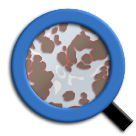
```

- Freely available and open-source; Windows, Mac, Linux.

- Dedicated to histopathology.

- Integration of machine learning.

- Growing academic recognition.

]

.pull-right[
```{r, echo=FALSE, warning=FALSE, message=FALSE, dev='svg'}
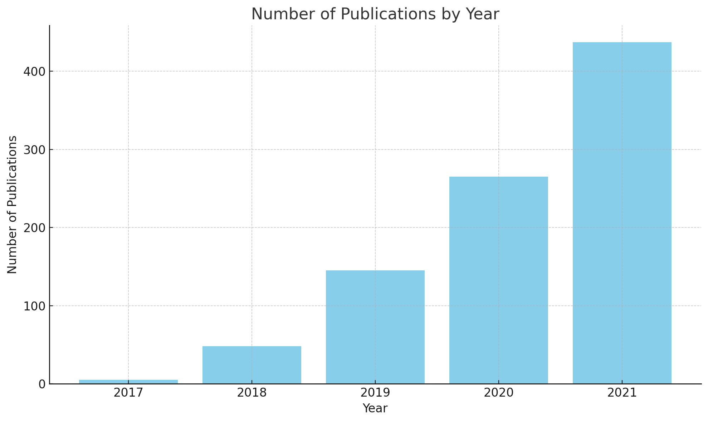
```
]

---

### Main QuPath window

```{r, echo=FALSE, warning=FALSE, out.width="80%", message=FALSE, dev='svg'}
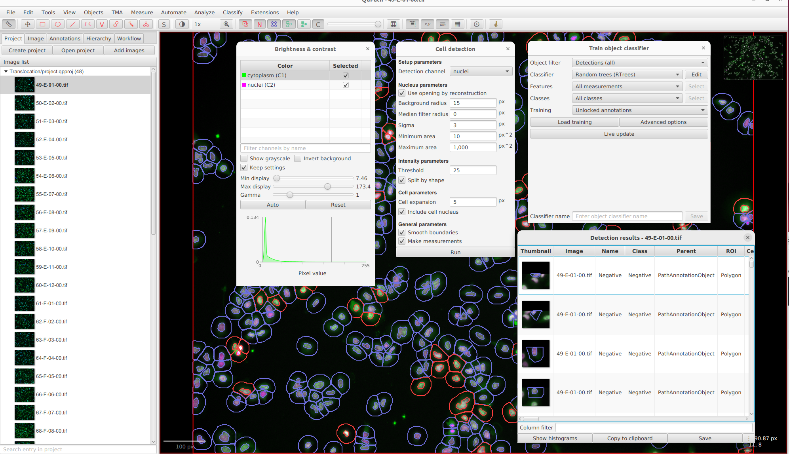
```

---

## QuPath

### Exercise: Lung Ki67 Cell Classification

The focus is on classifying cells based on Ki67 expression, which is a marker of cell proliferation.

```{r, echo=FALSE, warning=FALSE, out.width="35%", message=FALSE, dev='svg'}
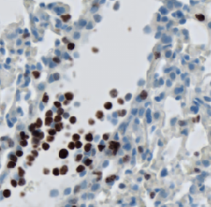
```

