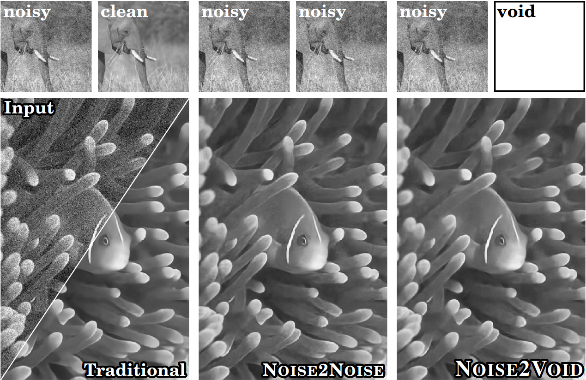
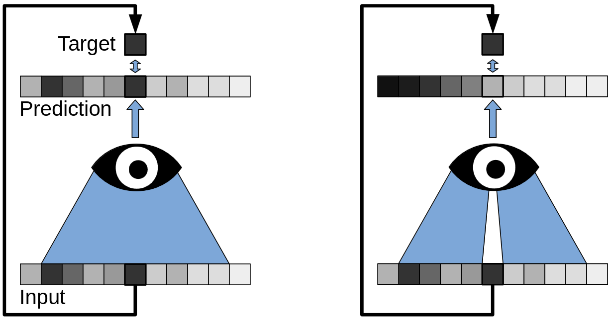

```{r xaringan-themer, include=FALSE, warning=FALSE}
library(xaringanExtra)
library(xaringanthemer)
style_duo_accent(
  primary_color = "#035AA6",
  secondary_color = "#03A696")
```

```{r xaringanExtra, echo = FALSE}
xaringanExtra::use_progress_bar(color = "#0051BA", location = "top", height = "10px")
```

## Introduction

Noise2Void (N2V) is a deep learning model designed for image denoising. Unlike traditional methods that require paired noisy-clean images, N2V only needs noisy images for training.

---

## What is Noise2Void?

### Key Concepts

- **Self-supervised learning**: N2V leverages self-supervised learning to train the model using only noisy images.
- **Noisy Image**: The input image containing noise.
- **Clean Image**: The desired output image with reduced noise.

```{r, echo=FALSE, out.width="40%", warning=FALSE, message=FALSE, dev='svg', fig.cap="Illustration of self-supervised learning in N2V.", fig.align='center'}

```
---

## How Does Noise2Void Work?

### Process Overview

1. **Masking Pixels**: Random pixels in the input image are masked.
2. **Context Prediction**: The model predicts the value of masked pixels using the surrounding context.
3. **Loss Calculation**: The difference between the predicted and actual values of masked pixels is used to update the model.

```{r, echo=FALSE, out.width="40%", warning=FALSE, message=FALSE, dev='svg', fig.cap="llustration of blind-spot training in N2V.", fig.align='center'}

```
---

## Advantages of Noise2Void

### Key Benefits

- **No Need for Clean Images**: Unlike supervised methods, N2V does not require paired noisy-clean images.

- **Single Image Training**: N2V can be trained on a single noisy image.

- **Versatility**: Effective for various types of noise.

---

## Conclusion

Noise2Void is an effective and flexible approach to image denoising, requiring only noisy images for training. By masking and predicting pixels based on their context, N2V achieves impressive denoising performance.

## References

- Krull, A., Buchholz, T., & Jug, F. (2019). Noise2void - Learning Denoising From Single Noisy Images. *Proceedings of the IEEE Conference on Computer Vision and Pattern Recognition (CVPR) 2019*.

